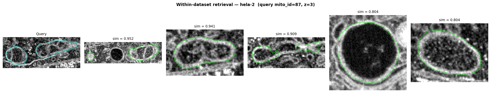
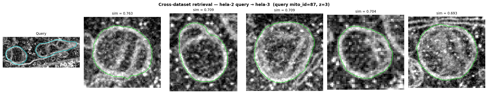

# EM Microscopy Image Analysis — Take-Home Challenge

## Use of LLMs

Claude code was used as a coding and debugging assistant during this project. Specifically:

- **Code implementation:** Writing boilerplate and scaffolding for data loading, zarr I/O, and matplotlib visualizations
- **Debugging:** several bugs when generating the dense embedding data and query retrieval


All core technical decisions were made independently:
- Dataset and scale selection (hela-2/hela-3 at s1), and the reasoning around it
- Patch size justification based on observed ~100 px mito diameter at s1 resolution
- Query selection strategy
- All code has been reviewed and tested to ensure correctness and meaningfull for the requirements

---

## Setup

```bash
conda create -n dino_em python=3.10
conda activate dino_em
pip install -r requirements.txt
pip install torch torchvision --index-url https://download.pytorch.org/whl/cu128
```

Create a `.env` file in the project root with your HuggingFace token:
```
HF_TOKEN=hf_your_token_here
```
if you dont have hf token, you need to create a new one and request permisson for dinoV3 model on huggingface.
---

## Dataset Exploration

**Script:** `src/explore_dataset.py`

```bash
python src/explore_dataset.py
```

Connects anonymously to the OpenOrganelle S3 bucket, inspects the multiscale EM volumes for both datasets, and saves a mid-z s1 slice per dataset to `outputs/`.

### Scale levels

**hela-2** 

| Level | Shape (Z × Y × X) | XY resolution | Z resolution |
|-------|-------------------|---------------|--------------|
| s0 | 6 368 × 1 600 × 12 000 | 4.0 nm/px | 5.24 nm/px |
| s1 | 3 184 × 800 × 6 000 | 8.0 nm/px | 10.48 nm/px |
| s2 | 1 592 × 400 × 3 000 | 16.0 nm/px | 20.96 nm/px |
| s3 | 796 × 200 × 1 500 | 32.0 nm/px | 41.92 nm/px |
| s4 | 398 × 100 × 750 | 64.0 nm/px | 83.84 nm/px |

**hela-3** 

| Level | Shape (Z × Y × X) | XY resolution | Z resolution |
|-------|-------------------|---------------|--------------|
| s0 | 12 000 × 1 000 × 12 400 | 4.0 nm/px | 3.24 nm/px |
| s1 | 6 000 × 500 × 6 200 | 8.0 nm/px | 6.48 nm/px |
| s2 | 3 000 × 250 × 3 100 | 16.0 nm/px | 12.96 nm/px |
| s3 | 1 500 × 125 × 1 550 | 32.0 nm/px | 25.92 nm/px |
| s4 | 750 × 62 × 775 | 64.0 nm/px | 51.84 nm/px |

All levels are `uint16`, chunked at `64 × 64 × 64`.

both hela-2 and hela-3 s0 x, y resolution is 4 nm/px, z resolution is different.

### Observations

We work on the 2d slices, so z resolution is not relevant for this task.
- **we choose s1 as working dataset:** 
At s1 (8 nm/px) a mitochondrion is ~50-150px across → ~6 DINO patches across its diameter, ~36 patches in 2d area. Each 128nm patch captures can capture details inside mito (cristae,membrane). Resolution too small will see noise, too large might miss details.

---

## Task 1 — Data Acquisition

**Script:** `src/task1_data_acquisition.py`

```bash
python src/task1_data_acquisition.py
```

Downloads EM image data and mitochondria segmentation labels from the [OpenOrganelle](https://openorganelle.janelia.org/organelles/mito) repository for two HeLa cell datasets: `hela-2` and `hela-3`.

**Dataset selection:** Both are HeLa cells, and they should share same kind of image features

**Scale level:** `s1` (~8 nm/px in XY). `s1` is the right balance considering structure details and inference speed.

**Spatial crop:** X axis is center-cropped to 2048 px to cut down image size while keeping the center.

**Slice selection:** 5 slices evenly spaced within ±100 z-planes of the volume midpoint.

**Outputs per dataset** (`data/{dataset}/`):
- `em.zarr` — raw EM slices, uint16
- `mito_seg.zarr` — segmentation labels
- `em_stack.tif` / `mito_stack.tif` — tiff to view image in ImageJ
- `metadata.json` — z-indices, crop coordinates, mito count

---

## Task 2 — Feature Extraction with DINOv3

**Script:** `src/task2_feature_extraction.py`

```bash
python src/task2_feature_extraction.py
```

Extracts patch-level and dense per-pixel embeddings from both datasets using a frozen DINOv3 ViT-B/16 backbone (`facebook/dinov3-vitb16-pretrain-lvd1689m`).

### Patch size

The patch size is fixed within the dinoV3 model and can not be changed. DINOv3 ViT-B/16 uses 16×16 px patches.

At s1 resolution, a mito covers roughly 100 px in diameter, which maps to ~6 patches across and ~36 patches over its 2D. Each 16 px patch covers 128×128 nm — a region that spans several cristae repeats and captures organelle-level texture.

Although patch size can not be changed in dinoV3 model, the input image can use different scales(S0-4) to test which one can have the best performance.


### Dense embeddings

DINOv3 outputs one 768-d token per 16×16 patch, reshape to get a spatial grid `[768, grid_h, grid_w]`.

Upsample the patch grid back to the original image resolution using bilinear interpolation

This is a parameter-free method — no learned upsampling, just interpolation of the existing token values.

Another possible approach is using transposed conv, but it has trainable parameters and need training.

**Outputs per dataset:**

`data/{dataset}/embeddings.npz`:
- `patch_tokens` — `[Z, N, 768]`, one token per patch per slice (flattened)
- `feat_maps` — `[Z, 768, grid_h, grid_w]`, same tokens in spatial layout
- `grid_shape` — `[grid_h, grid_w]`
- `orig_shape` — `[H, W]`, target size for upsampling

`data/{dataset}/dense_embeddings.zarr`:
- shape `[Z, 768, H, W]`, float16, chunked per slice — one dense embedding map per pixel per slice

---

## Task 3 — Embedding-Based Retrieval & Visualization

**Script:** `src/task3_retrieval.py`

```bash
python src/task3_retrieval.py
```

### Approach

Each mitochondrion instance is represented by mean-pooling the patch tokens within its segmentation mask (mask downsampled to patch-grid resolution). Each `(z, mito_id)` pair is treated as an independent sample.

The query is selected as the largest mitochondrion in hela-2 by patch count, giving a well-sampled instance with stable mean-pooled embedding.

Retrieval is done via cosine similarity between the query embedding and all other samples.

### Within-dataset retrieval

Query mitochondrion from hela-2 ranked against all other hela-2 samples.



### Cross-dataset retrieval

Same query ranked against all hela-3 samples.



### Multiple queries

Instead of a single query embedding, select several mitochondria covering different morphologies (e.g. small, large, elongated) and average their `[768]` embeddings into one mean query vector. Retrieval then runs the same cosine similarity against all candidates using this mean vector — no changes to the retrieval or visualization code beyond how the query is constructed.

The mean query acts as a prototype that smooths out per-instance noise. Compared to a single query, it is less sensitive to the specific shape or size of one mitochondrion, so the top-K results are likely to be more diverse.

---

## Task 4 — Improving Mitochondria Detection with Minimal Fine-Tuning

The retrieval results in Task 3 show that frozen DINO features already separate mitochondria from background reasonably well — the embeddings cluster by organelle identity even without any domain-specific training. This means we don't need to fine-tune the backbone; we just need to learn the decision boundary on top of it.

### Approach: frozen backbone + segmentation head

Keep DINOv3 frozen entirely. Attach a small segmentation head to the dense embeddings produced in Task 2:

- **Input:** `[768, H, W]` dense feature map per slice
- **Head:** a 1×1 conv `768 → 1` + sigmoid for binary mito/background prediction
- **Parameters:** 769 (weights + bias) — essentially a linear probe per pixel
- **Supervision:** binary masks derived from the `mito_seg.zarr` labels, with binary cross-entropy loss

This is the minimal option. If the linear probe underfits — e.g. mito boundaries are blurry or small mitos are missed — a lightweight 3-layer conv decoder (`768 → 256 → 64 → 1`) adds more capacity while still keeping trainable parameters in the low thousands. The backbone stays frozen throughout.

### Why this works

The Task 3 retrieval already demonstrates that mito patch tokens are geometrically close in embedding space. A linear probe just needs to find a hyperplane separating mito from non-mito tokens — which is a much easier problem than learning features from scratch.

### Training data

The segmentation masks from OpenOrganelle cover hela-2 and hela-3. With only a linear head to train, even 5–10 annotated slices per dataset is likely sufficient. The cross-dataset retrieval results suggest the features generalize across datasets, so training on hela-2 and evaluating on hela-3 is a reasonable test of generalization.
